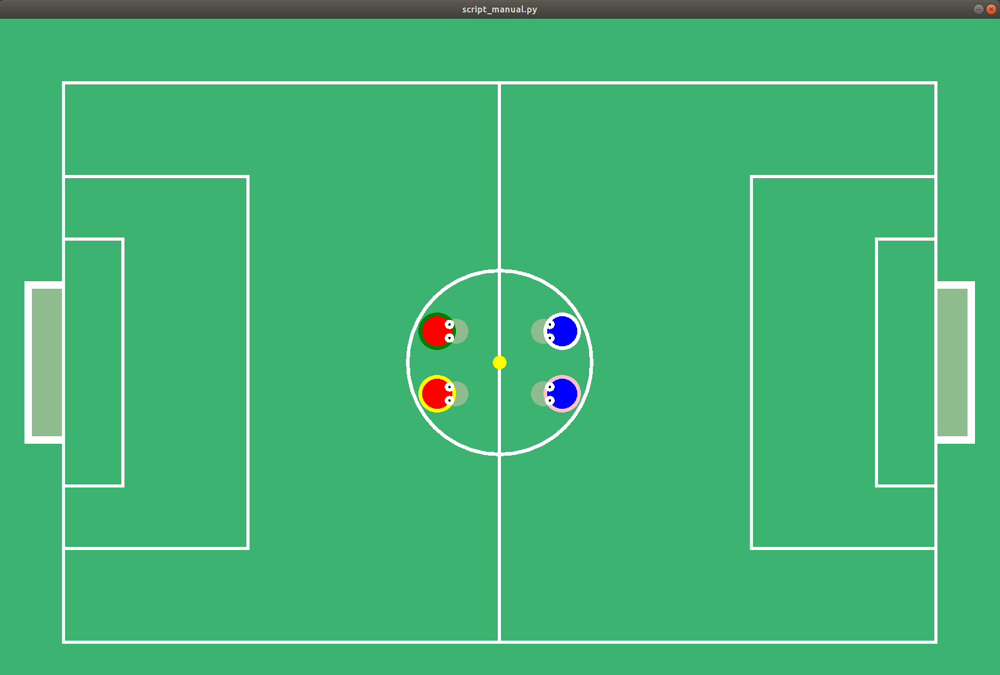

# Robocup

## Présentation
La Robocup était un jeu d'équipe où s'affrontent deux équipes dans un match de football.
Pour que les joueurs soient performants, il est nécessaire de les entrainer. Le projet qui nous a été proposé à pour 
but de développer un environnement (terrain de football, règles générales du foot, nombre de joueurs, pénalités, ...)
variable dans contexte multi-agents (Plusieurs agents autonomes dans la même équipe) dans lequel vont s'affronter deux équipes 
de joueurs autonomes. Pour entrainer les joueurs, le projet implémente un script d'apprentissage par renforcement 
(algorithme génétique), un script d'évaluation d'un algorithme contre un agent aléatoire ainsi qu'un mode manuel 
permettant de tester les fonctionnalités ainsi que les paramètres d'une partie. Le script manuel peut être joué avec 4 
humains via les touches du clavier (les commandes seront définies plus tard)


## Tables des matières

> [Robocup](#Robocup)
>  * [Présentation](#Présentation)
>  * [Tables des matières](#Tables-des-matières)
>  * [Installation](#Installation)
>  * [Comment l'utiliser](#Comment-l-utiliser)
>   * [Mode manuel](#Mode-manuel)
>   * [Mode entrainement](#Mode-entrainement)
>   * [Mode évaluation](#Mode-evaluation)
>   * [Le JSON](#JSON)
>   * [Les tests](#tests)
>  * [Structure du code](#Structure-du-code)
> 

## Installation
Le projet peut être récupéré via git sur notre répertoire savane (Attention, le projet est en privé donc seule 
le chargé de td et le client y ont accès).
<br/>Dépôt du projet 
```shell 
git clone https://services.emi.u-bordeaux.fr/projet/git/m1-pdp-15
```

Pour accéder au projet ainsi qu'a script, il faut exécuter les commandes suivantes
```shell
cd m1-pdp-15/src/robocup/
```

Une fois dans le dépôt avec le code source, vous avez accès aux différents scripts (manuel, apprentissage, évaluation)
Mais tout d'abord, vous devez installer une liste de library utilisé par python. Une liste de library généré par python 
est disponible dans le fichier REQUIREMENTS.txt. La version minimal que nous avons utilisé est composé de : 
* python version 3.6.9
* pip version 21.0.1
* numpy version 1.19.5
* gym version 0.18.0
* colour version 0.1.5
* setuptools version 54.2.0
* pyglet version 1.5.0
* parameterized version 0.8.1


##Comment l'utiliser
Une fois toute les library installé, vous pouvez tester le fonctionnement général de l'application avec la commande :
```python script_manual.py```
ou (en fonction de votre installation)
```python3 script_manual.py```

Une fois lancé, vous devrez avoir cette fenêtre de jeu qui s'affiche : 



###Mode manuel
Le mode manuel comme présenter plus haut permet de tester via le clavier l'interface de jeu dans un environnement basique. 
Les paramètres de jeu sont défini dans le fichier env.json disponible dans le répertoire src/robocup/specs/env.json.
Dans cette partie, seulement 4 joueurs sont implémentés, les paramètres de jeu seront explicité plus tard dans ce chapitre.
La partie dure 10 minutes et un changement de côté du terrain se lance après 5 minutes.

Pour jouer avec les agents, chaque joueur dispose de 7 touches (avancer, reculer, aller à droite, aller à gauche, tourner à droite, 
tourner à gauche et tirer).
Les commandes sont réparties comme cela : 
* Agent 1 (le jaune) 
<br/>Avancer/reculer : Z/Q 
<br/>Aller à droite/gauche : D/Q
<br/>Tourner à droite/gauche : E/A
<br/>Tirer : W  
  
* Agent 2 (le vert) 
<br/>Avancer/reculer : T/G 
<br/>Aller à droite/gauche : H/F
<br/>Tourner à droite/gauche : Y/R
<br/>Tirer : C  
  
* Agent 3 (le rose) 
<br/>Avancer/reculer : I/K 
<br/>Aller à droite/gauche : L/J
<br/>Tourner à droite/gauche : O/U
<br/>Tirer : N  
  
* Agent 4 (le gris) 
<br/>Avancer/reculer : flèche directionnelle haut/flèche directionnelle bas
<br/>Aller à droite/gauche : flèche directionnelle droite/flèche directionnelle gauche
<br/>Tourner à droite/gauche : NUM_PAD_3/NUM_PAD_1
<br/>Tirer : Espace
  
###Mode entrainement
Le mode entrainement comme introduit plus haut permet d'entrainer avec un algorithme implémenté un agent. 
Un script d'apprentissage par renforcement via un algorithme génétique est disponible dans le répertoire 
src/robocup/training_scripts/train_ga_selfplay.py.
L'environnement de jeu est pré-implémenté dans la class Model du fichier /robocup/model/mlp.py.
Dans cette partie, 4 joueurs sont implémentés de base, les paramètres de jeu seront explicités plus tard dans ce chapitre.
La partie dure 10 minutes et un changement de côté du terrain se lance après 5 minutes.
Au total, 5000 parties vont être jouées et une sauvegarde est effectuée toutes les 500 parties.
La population de départ est de 128.
Ces valeurs sont modifiables par l'utilisateur selon ces besoins. Elles ne sont pas encore pré-chargées un fichier json.

Le mode entrainement peut être lancé via la commande : 
```shell
python training_scripts/train_ga_selfplay.py.
```
ou (en fonction de votre installation)
```shell
python3 training_scripts/train_ga_selfplay.py
```

Une fois les 5000 parties effectuées, une liste de fichiers json est disponible dans un dossier ga_selfplay. Le résultat
final de l'entrainement ainsi que les sauvegardes sont dans ce répertoire et peuvent être utilisés plus tard dans le mode
d'évaluation.
###Mode evaluation
La mode évaluation comme introduite plus haut permet d'évaluer le résultat d'algorithmes contre une équipe avec 
des mouvements aléatoires.Les paramètres de jeu sont définis dans le fichier env_eval.json disponible dans le répertoire 
src/robocup/specs/env_eval.json.Dans cette partie, seulement 4 joueurs sont implémentés, les paramètres de jeu seront 
explicités plus tard dans ce chapitre. La partie dure 10 minutes et un changement de côté du terrain se lance après 5 
minutes. Les paramètres par défaut utilisé sont : 2 agents random qui s'affrontent, l'affichage est actif et le nombre 
d'essais est de 10.
Des résultats d'entrainement sont disponibles dans le répertoire src/robocup/training_scripts/ga_selfplay/
Le mode entrainement peut être lancé via la commande :
```shell 
python script_evaluation_multiagent.py
```
ou (en fonction de votre installation)
```shell 
python3 script_evaluation_multiagent.py
```

Une fois les 10 essaies joués, les données sont stockées dans un fichier CSV ainsi que le résultat moyen de chaque équipe

### Le JSON
Pour simplifier le paramétrage des parties, un fichier json est disponible pour paramétrer la partie.
La version alpha de ce fichier JSON permet de : 
<br/>Choisir le model de jeux 'RoboCupAdultSize-v0' ou 'RoboCupKidSize-v0'
<br/>Configurer la partie avec les paramètres suivant dans la catégorie configuration -> chaine de caractère :
* 'collision_disable' -> désactive les collisions
* 'allies_vision_disable' -> désactive la vision des alliés pour l'agent
* 'opponents_vision_disable' -> désactive la vision des ennemis pour l'agent
* "left_path" : "" -> permet de spécifier le chemin vers le fichier json contenant le résultat d'un entrainement. 
  Il sera ensuite intégré dans chaque agent de l'équipe de gauche (évaluation uniquement)
* "right_path" : "" -> permet de spécifier le chemin vers le fichier json contenant le résultat d'un entrainement. 
  Il sera ensuite intégré dans chaque agent de l'équipe de droite (évaluation uniquement)
* "render": 1, -> 0 : n'affiche pas la fenêtre de jeu, 1 : affiche la fenêtre de jeu (évaluation uniquement)
* "trials": 10 -> nombre d'essais pour l'évaluation (évaluation uniquement)
* "seed" : 0 -> graine aléatoire de base qui sera utilisé dans l'évaluation (évaluation uniquement)

### TESTS

L'ensemble des tests sur chaque nouvelle fonction ont été réalisés grâce à la lib unittest de python
Lancement avec la commande dans le répertoire robocup :
```shell
python -m unittest discover test/
```
ou 
```shell
python3 -m unittest discover test/
```
## Structure du code
specLe code est structuré en plusieurs parties : création, dynamic_objerulesules, spec, utilityviewview. 
(Plus d'informations dans le mémoire).Pour modifier à ce qui touche au terrain et à l'environnemetoutestout les 
informations sont disponibles dans le répertspec.Pour modifier les agents, balle ou équipe, tout est disponible dans 
le répertoire dynamic_objectPour ajouter des règles de jeu, la classe referee est disponible dans le fichier rules. 
Pour appliquer les règles, il faut ensuite modifier la méthode step() de game et y ajouter les appels aux nouvelles 
règles.

